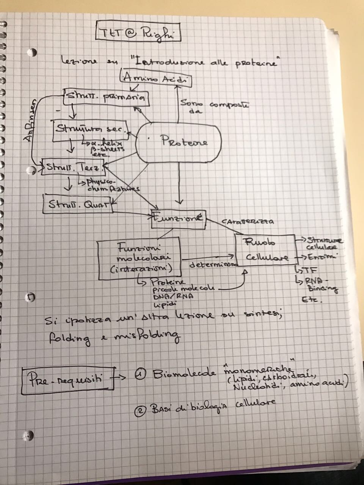

#Preparazione di lezioni e materiali didattici

> -----
> ###Programma
> 
> 1. Mappe concettuali
> 2. Obiettivi di apprendimento e risultati di apprendimento
> 3. Come preparare una lezione
> 4. Come progettare un intero corso
> 5. Come sviluppare materiale didattico
> 
> ------

## Concept maps

> From Ambrose et al (2010) "How learning works" - Appendix B
> 
esign a talk, a lesson, a session or even an entire course.
> 
Le mappe concettuali sono strumenti grafici per organizzare e rappresentare la conoscenza (Novak e Cañas 2008, "Theory underlying concept maps and how to construct them"). Vengono disegnate come nodi e collegamenti in una struttura a forma di rete in cui i nodi rappresentano i concetti, generalmente racchiusi in cerchi o quadrati, e i collegamenti rappresentano le relazioni tra i concetti. I collegamenti sono linee che possono avere una direzione oppure no, ed è possibile scrivere una frase sulle linee di collegamento per specificare la natura della relazione tra i due concetti.
> Sia gli insegnanti che gli studenti possono beneficiare della costruzione di mappe concettuali. È possibile chiedere agli studenti di disegnare mappe concettuali per ottenere indicazioni su ciò che già sanno e per capire come essi rappresentano la loro conoscenza. È quindi possibile utilizzare queste informazioni per indirizzare il vostro insegnamento. È inoltre possibile utilizzare una mappa concettuale per la progettazione di un discorso, una lezione, una sessione o addirittura un intero corso.
> 
> The ["Theory underlying concept maps and how to construct them"](http://cmap.ihmc.us/Publications/ResearchPapers/TheoryUnderlyingConceptMaps.pdf) di Novak and Cañas è un documento eccellente da leggere nel caso vogliate sapere di più sulle mappe concettuali e su come costruirle.
> 
> Da Novak e Cañas:
> 
> The  starting  point   for  constructing  a  concept   map   can  consist  of  only  the   *focus  question*. It is important that a question be given (e.g. "What is the structure of the Universe?" and not just a topic (e.g. “make a concept map about the Universe”) since  answering  the  question  helps focus on your map. 
> 
>  A second step for the  construction of the concept map can be a  list of concepts  that  you want to  definitely include  in  your  map.  We  refer  to  a  list  of  concepts  waiting  to  be  added  to  a  concept   map  as  the  parking  lot of concepts. 
> 
> **The beginning of a concept map with a focus question and a parking lot with concepts to be included in the map:**
> 
> Il punto di partenza per la costruzione di una mappa concettuale può essere costituito da una "domanda chiave". E 'importante che vi sia una domanda alla base della costruzione di una mappa concettuale (ad esempio "Qual è la struttura dell'Universo?") e non un argomento (ad esempio “fare una mappa concettuale dell'Universo”), in quanto rispondere alla domanda aiuta a focalizzarsi sulla mappa.
>
> Un secondo passo per la costruzione della mappa concettuale può essere un elenco di concetti che si desidera sicuramente includere nella mappa. Una lista di concetti in attesa di essere aggiunti alla mappa concettuale, può essere pensata come un "parcheggio di concetti" (parking lot)

>
> ** L'inizio di una mappa concettuale può essere dunque una domanda che metta a fuoco ciò che si vuole dalla mappa concettuale e un parcheggio con i concetti da inserire nella mappa: **
> 
> 
> 
> 
> **An expert skeleton concept map** 
> The concept map deals with a key concept that needs to be understood as a foundation for learning science. It is based on the parking lot from the previous figure. Some comcepts were left in the parking lot for subsequent addition.
> 
> **Uno scheletro di una mappa concettuale prodotto da un esperto**  
> La mappa concettuale qui sotto si basa sulla precedente lista di concetti del "parcheggio". Alcuni concetti sono rimasti nel parcheggio per essere aggiunti successivamente.
> 
> 

## Pianificazione e progettazione di una sessione/lezione

* Definire gli obiettivi di apprendimento;
* Definire i risultati di apprendimento;
* Identificare le conoscenze precedenti necessarie a comprendere l'argomento;
* Verificare le conoscenze precedenti della classe sull'argomento;
* Pensare a come riempire eventuali lacune;
* Disegnare una mappa concettuale dell'argomento della lezione.
* Decidere quanto tempo allocare per cascuna attività e preparare un outline;
* Decidere l'ordine delle attività;
* Cercare di includere almeno una sessione di "riscaldamento", una breve "lecture", un'attività pratica o di gruppo e un sessione di chiusura.

**Riscaldamento**  

* Descrivere chiaramente gli obiettivi di apprendimento e i risultati attesi. 
* Descrivere cosà verrà spiegato e come questo sia in relazione con gli argomenti precedenti.
* Il "riscaldamento" può includere un'attività fatta dagli studenti, come risolvere un esercizio, rispondere ad un breve questionare, o fare un gioco di predizione.

**Scopo**: Attivare la conoscenza precedente, preparare la mente ad apprendere, introdurre l'argomento 

**Lecture** 

* Qui è dove si può trasferire contenuto. 
* Fare in modo di avere obiettivi di apprendimento molto chiari. 
* Cercare di rendere la lecture il più interattiva possibile. * Considerare l'utilizzo di un breve video, di immagini stimolanti, di citazioni appropriate, ed esempi tratti dalla vita reale.

**Attività pratica/di gruppo**

* Questa può essere un tutorial, uno o più esercizi, un gioco, un'attività di gruppo.
* Prevedere tempo sufficiente per completare l'attività e siate pronti ad aggiungere un po' di tempo se necessario.
* Mostrare la soluzione degli esercizi o chiedere ad uno o più studenti di mostrare la loro soluzione. 
* Fare un veloce giro di feedback (ad esempio: one-good-one-bad) 

**Wrap-up** 
Il wrap-uo può essere utilizzato per ripetere i concetti principali illustrati durante l'insegnamento. Questo dovrebbe essere preferibilmente fatto dagli studenti e può anche essere utilizzato per valutare i risultati dell'apprendimento (ad esempio utilizzando un questionario con domande simili alle domande del questionario di warm-up, o di qualsiasi altro test).
Durante il wrap-up, si può anche valutare se le aspettative degli studenti sono state raggiunte e raccogliere il loro feedback.

## Lezione su: "Introduzione alle proteine"

### Obiettivo di apprendimento: Conoscenza e comprensione della relazione tra 

- composizione chimica 
- struttura primaria 
- struttura secondaria
- struttura terziaria
- struttura quaternaria

e la funzione molecolare e cellullare delle proteine.

### Risultati di apprendimento:

- L'alunno sarà capace di riconoscere sulla (pagina di wikipedia sulle proteine)[https://it.wikipedia.org/wiki/Proteine] ciò che l'insegnante non ha detto durante la lezione.
-  Saprà inoltre riportare alla classe un concetto ed un esempio "extra" estratti da wikipedia.
- 

### Mappa concettuale 

Uno schema di una lezione da 1h15 potrebbe essere il seguente:

|Time|Activity|Description|Goal/Outcome|
|------|-------|-----------------------------|----------------|
|10 mins|warm-up|Gli studenti descrivono le caratteristiche fisico-chimiche degli amino acidi e elementi di base di biologia cellualere e rispondono alle domande dei compagni. L'insegnante descrive il piano della lezione nel dettaglio.|Recupero dalla memoria, ripetizione, preparazione al nuovo argomento, esposizione degli studenti|
|20 mins|lecture|Le proteine (vedi mappa concettuale)|Imparare cosa sono le proteine e come funzionano.|
|20 mins|Attività pratica|Lavoro in gruppi o in coppie. Ad ogni gruppo viene assegnata una sezione della pagina di wikipedia in cui gli studenti devono individuare concetti nuovi ed esempi che l'insegnante non ha detto durante la lezione e prepare domande sui punti non chiari|Riconoscimento sulla (pagina di wikipedia sulle proteine di ciò che l'insegnante non ha detto durante la lezione e formulazione di domande pertinenti|
|10 mins|wrap-up|Ogni gruppo riporta velocemente il risultato del proprio lavoro. L'insegnante risponde alle domande.|Valutazione dell'apprendimento, chiarimento di concetti, ripetizione|

