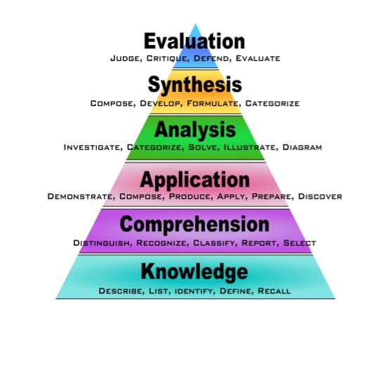
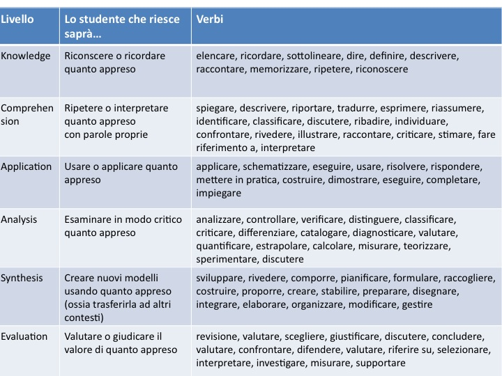
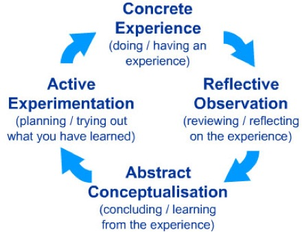

##Scienze cognitive e apprendimento

> -----
> ###Programma
> - 1 Obiettivi e risultati di apprendimento
> - 2 Abilità e competenze cognitive. Tassonomia di Bloom
> - 3 Apprendimento: principali teorie
> - 4 Modelli rilevanti nelle scienze cognitive
>   - 4.1 Kolb's cycle and learning styles
>   - 4.2 Conoscenza "dichiarativa" e "procedurale"
> - 5 Come funziona l'apprendimento
>   - 5.1 Principianti, competenti, esperti
> - Cosa funziona...
>   - Recuperare dalla memoria
>   - Predire
>   - Alternare/intervallare
> 
> ------

###1 Obiettivi e risultati di apprendimento

- Obiettivo di apprendimento (learning objective)

- Risultati di apprendimento (learning outcomes) 

#### 1.1 Gli obiettivi di apprendimento devono essere "SMART"

- **Specific – Specifici**: 
  Devono specificare cosa lo studente deve sapere e/o essere capace di fare e a quale livello
- **Measurable – Misurabili**: Mediante verifiche
- **Achievable – Realizzabili**: Devono essere realizzabili dagli studenti nel tempo a disposizione e nelle specifiche condizioni o contesto in cui si trovano 
- **Relevant – Rilevanti**: Devono essere rilevanti relativamente alle necessità degli studenti, del programma, della scuola. 
- **Time-Framed – Realizzabili in un dato arco di tempo**: Devono essere realizzabili nell'arco di tempo di una lezione, di una serie di lezioni, di un quadrimestre, dell'anno scolastico.

#### 1.2 Come scrivere learning outcome che siano specifici, misurabili, rilevanti e time-framed

- Cominciare la frase con: "per la fine di questa lezione, lo studente sarà capace di…."
- Aggiungere un verbo che esprima un'azione osservabile/verificabile
- Evitare verbi aperti a interpretazioni (es: capire, sapere, imparare, afferrare, etc)
- Quando necessario, specificare i criteri riguardanti gli standard attesi di performance (ad esempio: rubriche di punteggi)

#### 1.3 Rubriche di punteggi o Griglie di valutazione

- Una griglia di valutazione è un modo per comunicare le aspettative di qualità riguardo ad un compito o una verifica. 
- In molti casi, le griglie di valutazioni vengono utilizzate dagli insegnanti per delineare criteri coerenti di valutazione. 
- Le griglie di valutazione permettono agli studenti di comprendere i criteri adottati per la loro valutazione.

Le griglie di valutazione andrebbero rese molto specifiche e condivise con gli studenti sin dall'inizio del corso.

>----
> ###Challenge 1
> Scrivete un obiettivo e un risultato di apprendimento per una delle vostre prossime lezioni.
> 
> - Per l'obiettivo di apprendimento, pensate a quale sia lo scopo della specifica lezione.
> - Per il risultato di apprendimento, usate quanto visto nelle sezioni 1.2 ed 1.3.
> 
> ----

###2 Abilità e competenze cognitive. Tassonomia di Bloom

>-------
>###Challenge 2
>- In che modo imparate meglio?
>- Qual è il vostro modo di imparare cose nuove?
>- Scrivete tre approcci che funzionano per ciascuno di voi
>- Discuteteli con un collega
>- Condivideteli con noi 
>
> [Risultati challenge 2](#challenge2)
> 
>------

##3 Apprendimento: principali teorie
- **Comportamentismo o behaviorismo** – L'apprendimento consiste nell'acquisire nuovi comportamenti per condizionamento; risposta agli stimoli; premio/punizione.
- **Cognitivismo** – L'apprendimento consiste nello sviluppo di capacità cognitive.
- **Connettivismo** – La conoscenza è percepita dall'ambiente e risiede nelle connessioni (cervello)

- 
##4 Modelli rilevanti nelle scienze cognitive

- "Learning styles"
  - Activist, Theorist, Reflector, Pragmatist
- Conoscenza "dichiarativa" e "procedurale" 
- Principianti, competenti, esperti

####4.1 Kolb's cycle and learning styles

 

 

- **Esperienza concreta** - Incontro con una nuova esperienza o situazione o re-interpretazione di un'esperienza già vissuta
- **Osservazione riflessiva** (di una nuova esperienza. Sono di particolare importanza le contraddizioni tra l'esperienza e la comprensione) 
- **Concettualizzazione e astrazione** (La riflessione stimola una nuova idea o la modifica di un concetto astratto esistente) 
- **Sperimentazione attiva** (colui che apprende applica quanto appreso al mondo circostante per vedere quali siano i risultati)

###4.2 Conoscenza "dichiarativa" e "procedurale"
- Conoscenza "dichiarativa"
  - Cosa?
- Conoscenza "procedurale"
  - Quando applicare? Come? Perché?

##5 Principianti, competenti, esperti

>----
>###Challenge 3
>Quali sono le principali differenze tra un principiante ed un esperto?
>
>- Discutetene in coppie e scrivete le tre differenze più importanti che vi vengono in mente.
>- Condividete le vostre idee con noi.
>-----

##6 Cosa funziona per...

###6.1 Attivare la conoscenza pre-esistente ed imparare nuovi concetti
Tipicamente gli studenti tendono a fare scelte discutibili quando devono apprendere nuove informazioni. In altre parole, molti studenti non hanno un metodo di studio efficace.
	- Molti pensano che sia sufficiente leggere un testo per impararne il contenuto
	- Molti credono che sapere la teoria sia sufficiente per saperla applicare (fare esercizi)
	- Molti tendono a studiare un argomento "tutto insieme", in modo concentrato ("massed studying") e tipicamente a ridosso delle verifiche.

>-------
>###Challenge 4
> - Che attività proponete o come strutturereste una lezione che favorisca:
> - Recupero dalla memoria
>  - Predizione
>  - Alternare e intervallare
>  - Discutete in gruppo, fate un elenco di proposte e condividetele con noi
> 
> ------

Le attività che possiamo sviluppare in classe sono:

**a) Esercizio della memoria/recupero dalla memoria a lungo termine**

  - Domande in apertura delle lezioni.
    - Prima di cominciare, chi può ricordarmi di cosa abbiamo parlato l'ultima volta?
    - Prima di introdurre il Sistema Solare, chi può dirmi quali siano le principali teorie su come si è formato il pianeta Terra? 
    - Nelle ultime tre lezioni, abbiamo visto vari esperimenti di chimica. Qualcuno potrebbe ricordarmi i risultati di almeno uno di questi?
  - Domande in chiusura delle lezioni
    - Focalizzarsi sui concetti chiave che vogliamo che gli studenti portino a casa da quella precisa lezione e chiedere loro di scriverli su un foglio di carta nei cinque minuti prima della fine dell'ora.
    - Si può anche rifare la stessa domanda (o le stesse domande) all'inizio e alla fine dell'ora (si veda l' attività di "predizione" sotto).

E' importante sapere che: 

- La frequenza è importante: più si pratica il recupero dalla memoria, più si impara. Proponete domande almeno una volta a settimana e non esitate a farne ad ogni lezione.
- Allineare pratica, verifiche e feedback: Qualsiasi esercizio di memoria si proponga agli studenti nei compiti in classe o nelle interrogazioni, dovrebbe comparire nelle pratiche di esercizio della memoria che usiamo in classe con una certa frequenza. 
- Aiutare gli studenti a ricordare fornendo loro degli agganci ad un contesto.  

**Quick Tips:**
   
**b) Predizione**

**c) Alternare/intervallare**

###6.2 Comprendere fatti e concetti
- Connettere
- Praticare
- Spiegarsi ad alta voce

###6.3 Ispirare
- Motivare
- Aiutare a crescere
- Coinvolgere

>----
>###<a name="challenge2">Risultati challenge 2</a>
>

>**Insegnante 1:** 
>
>Obiettivo: Le rocce e la loro classificazione.
>Risultato: 1) conoscere la definizione di roccia; 2) Come si originano le rocce, indicare i processi litogenetici; 3) Descrivere le caratteristiche generali e le differenze principali tra i tre processi; 4) Saper esporre utilizzando i termini corretti.

>**Insegnante 2:** 
>Obiettivo: Apprendere le differenze tra procarioti ed eucarioti.
>Risultato:L'alunno deve essere capace di elencare/ descrivere le differenze più importatni tra procarioti ed eucarioti.

>**Insegnante 3:** 
>Obiettivo: Aldeidi e chetoni.
>Risultato: 1) Caratteristiche; 2) descrivere l'argomento; 3) nomenclatura e proprietà fisiche.

>**Insegnante 4:** 
>Classe IV. Lezione di chimica su reazioni endoergoniche ed esoergoniche, in laboratorio.
>Obiettivo: Saper collegare la teoria della termodinamica chimica (energia interna, calore, entalpia) con misurazioni fatte in laboratorio su reazioni chimiche fatte dagli studenti stessi.
>Risultato: Distinguere una reazione endo ed esoergonica in base alla variazione della temperatura e alla produzione o assorbimento del calore usando termomentro e calorimentro.

>**Insegnante 5:** 
>Fine modulo
>Obiettivo: Descrivere le geometrie molecolari secondo il modello VSEPR.
>Risultato: Alla fine del modulo, 	lo studente sarà capace di rappresentarele principali molecole inorganiche disegnandone i legami, i relativi angoli, distinguendo tra strutture planari e tridimensionali, individuando la eventuale presenza di doppietti elettronici liberi e spiegando la loro influenza sulla forma della molecola.

>**Insegnante 6:** 
>Lezione: Struttura atomica - Orbitali - Distribuzione elettroni
>Obiettivo: Lo studente dovrà essere capace di conoscere le leggi fondamentali, capire i diversi tipi di orbitali.
>Risultato: Scrivere la configurazione elettronica di un elemento e descrivere i vari tipi di orbitali.

>**Insegnante 7:** 
>Lezione: Le proteine.
>Obiettivo: Concetti di monomero, polimero, gruppi fuzionali, legami chimici specifici, strutture tridimensionali.
>Risultato: Lo studente dovrà riconoscere questi concetti in una catena polipeptidica.
>
>----

